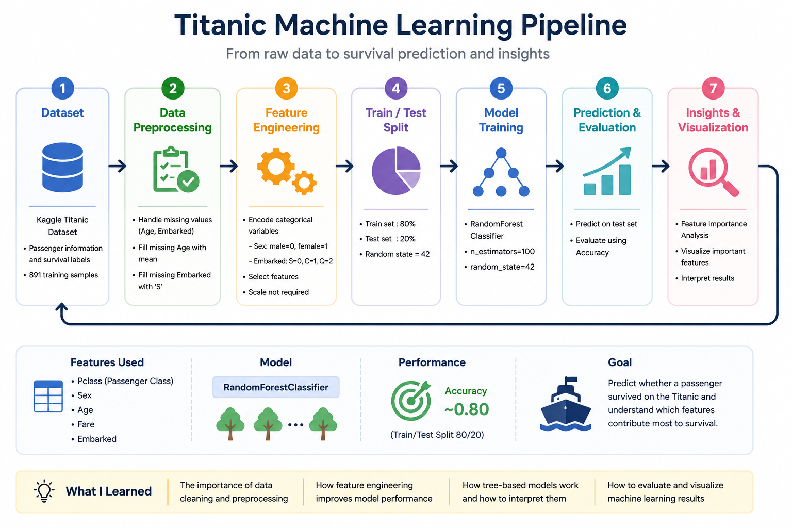
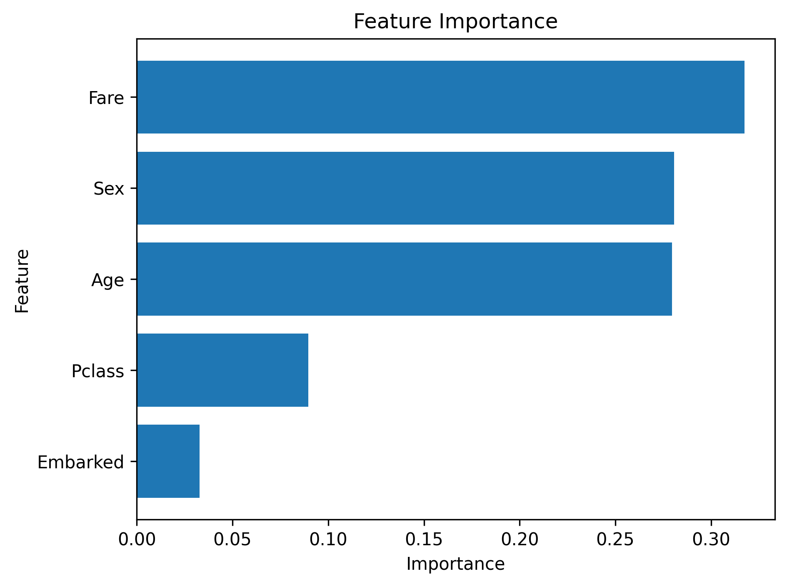

# Titanic Survival Prediction


---

## 📌 Overview

This project predicts passenger survival on the Kaggle Titanic dataset using **Machine Learning**.

The project demonstrates a complete data science workflow including data preprocessing, feature engineering, model training, evaluation, and feature importance analysis.

---

## ⭐ Key Features

- Missing value imputation
- Feature encoding
- Data visualization
- Random Forest Classification
- Feature Importance Analysis
- Model evaluation using Accuracy

---

## 🏗 Workflow

<p align="center">
  
</p>

---

## 🛠 Tech Stack

| Category | Technologies |
|----------|--------------|
| Language | Python |
| Libraries | pandas, matplotlib, scikit-learn |
| Machine Learning | RandomForestClassifier |
| Version Control | Git / GitHub |

---

## 📂 Project Structure

```text
kaggle-titanic/
│
├── data/
│   ├── train.csv
│   └── sample.csv
│
├── images/
│   ├── workflow.png
│   ├── feature_importance.png
│   └── eda.png
│
├── src/
│   ├── practice.py
│   ├── graph.py
│   └── titanic.py
│
├── requirements.txt
└── README.md
```

---

## 🚀 Workflow

1. Load the Titanic dataset
2. Handle missing values
3. Encode categorical variables
4. Split the dataset into training and testing sets
5. Train a Random Forest Classifier
6. Evaluate model performance
7. Visualize feature importance

---

## ▶️ How to Run

```bash
git clone https://github.com/shibata-bio/kaggle-titanic.git

cd kaggle-titanic

pip install -r requirements.txt

python src/titanic.py
```

---

## 📊 Result

**Accuracy**

```
0.80
```

### Feature Importance

<p align="center">
  
</p>

---

## 📖 What I Learned

- Importance of data preprocessing
- Handling missing values
- Feature engineering for machine learning
- Model evaluation using train/test split
- Interpreting Feature Importance
- Building an end-to-end machine learning workflow

---

## 🔮 Future Improvements

- Try XGBoost and LightGBM
- Perform hyperparameter tuning
- Apply cross-validation
- Improve feature engineering
- Submit predictions to Kaggle Leaderboard

---

## 📄 License

This project is licensed under the MIT License.
